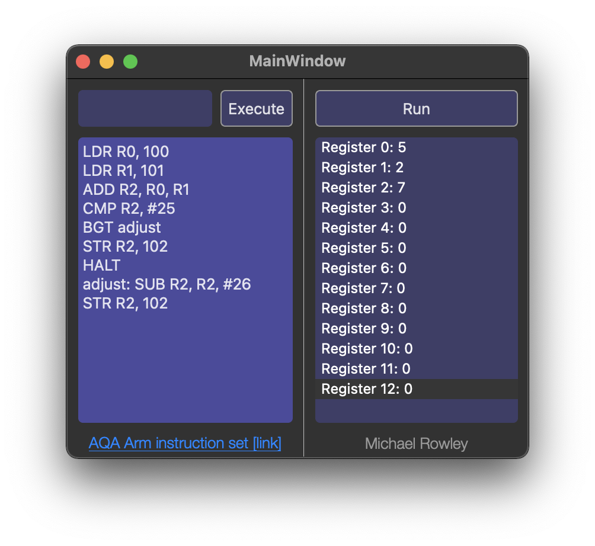

## What/Why
A-Level computer science covers a variety of topics, one of which involves some basic low-level programming - the ARM instruction set that needs to be known for exams is a reduced version released by AQA (the examination board) but no interpreter is provided.
There are a few other programs that achieve similar effects to this (namely two versions of interpreters from Peter Higginson that can be found [here](https://www.peterhigginson.co.uk/AQA/) & [here](https://www.peterhigginson.co.uk/ARMlite/) and another that is available [here](https://github.com/OliCallaghan/AQA-Assembler)). The main issue I've had with these tools is that some (not all) of them have excessive UIs that show information that isn't needed or contextually relevant for the A-Level syllabus and some also don't follow the AQA ARM instruction set accurately (additional instructions are added that would otherwise be unavailable in an exam).

### How
The interpreter itself is very basic and the hardest part of developing this program was designing it so that the modular nature of the codebase would allow simple addition of the AQA Arm instruction set.
The instruction set from AQA can be found [here](https://filestore.aqa.org.uk/resources/computing/AQA-75162-75172-ALI.PDF), AQArm follows the instruction set to the best of its ability and I am not aware of any deviation from the exam specification - comments, labels, branches, and all of the listed opcodes are supported.

### UI
The text area above the code area is a 'command line' (in the loosest sense due to its simplicity) which is used to setup the 'application' memory before running the user-provided code (useful in instances where a question specifies that values are stored in memory locations before execution) using the command ``SETMEM/XXXX/YYYY`` ``XXXX`` refers to the memory address having a value written to it and ``YYYY`` refers to the value being assigned to the memory address.
The right half of the window shows the registers after execution (0 through 12) but it does not currently show carry/comparison data nor the memory space/data belonging to the interpreted process instance.

### Examples
[Question 7.1](https://filestore.aqa.org.uk/sample-papers-and-mark-schemes/2020/november/AQA-75162-QP-NOV20.PDF) in the November 2020 AS paper involves implementing a caesar cipher, all three [solutions](https://filestore.aqa.org.uk/sample-papers-and-mark-schemes/2020/november/AQA-75162-W-MS-NOV20.PDF) are able to be run without modification using AQArm.

### Compiling
This project was developed using Qt's framework for UI development. In order to compile the project you should be able to open the ``.pro`` file in [Qt Creator](https://www.qt.io/product/development-tools) or by loading the full project as a directory via the Qt Creator user-interface.
